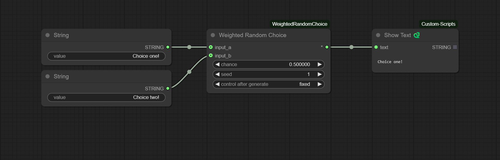

# ComfyUI-WeightedRandomChoice

A node for [ComfyUI](https://github.com/comfyanonymous/ComfyUI) that picks from `input_a` and `input_b` based on the given `chance`.

I'll be honest, I was a little surprised I couldn't find a node like this on the Comfy Registry. It's simple yet very useful for things like randomizing parts of a prompt.

### Installation

Simply drag the image above into ComfyUI and use [ComfyUI Manager » Install Missing Custom Nodes](https://github.com/ltdrdata/ComfyUI-Manager).

### Inputs

- `input_a`: Supports any datatype.
- `input_b`: Supports any datatype.
- `chance`: A float between 0 and 1 that indicates the probability of selecting `input_a`. For example, set this to 0.95 for a 95% chance to return `input_a`.
- `seed`: Useful for locking in a certain result.

### Output

As a quality of life feature, you can provide only `input_a` or `input_b`, and if the unconnected input is chosen, the node will return a default value based on the datatype of the other input.

For example, let's say you set `input_a` to 50 and leave `input_b` blank. If `input_b` is chosen, the node will return the default integer value of 0. For strings, it would return a blank string, and for floats, 0.0.